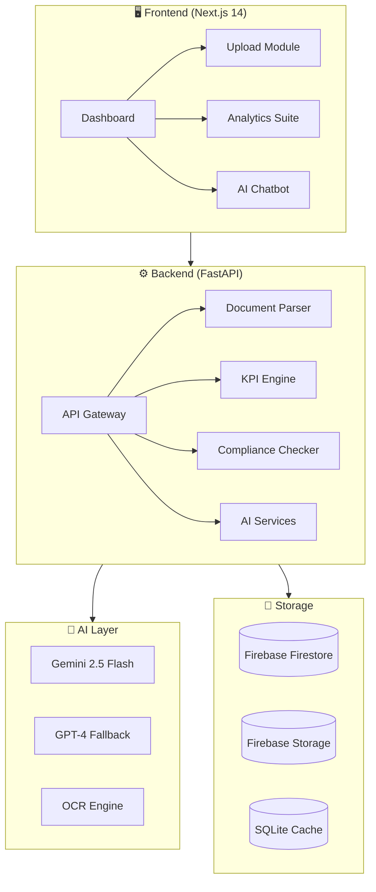

<p align="center">
  
</p>

<p align="center">
  <a href="#-overview"></a>
  <a href="#-overview"></a>
  <a href="#-overview"></a>
  <a href="#-overview"></a>
  <a href="#-overview"></a>
</p>

<p align="center">
  <a href="#-features"></a>
  <a href="#-architecture"></a>
  <a href="#-deployment"></a>
  <a href="#license"></a>
</p>

---

## 🎯 Overview

**Smart Approval AI** is an enterprise-grade, AI-powered document analysis platform designed to revolutionize how educational institutions handle accreditation compliance. Built with cutting-edge technologies, it processes institutional documents and extracts critical KPIs for regulatory bodies like **AICTE**, **NBA**, **NAAC**, and **NIRF**.

### 💡 The Problem We Solve

Traditional accreditation review processes are:
- 📄 **Manual & Time-Consuming** - Reviewers spend 40+ hours per institution
- ❌ **Error-Prone** - Human oversight leads to inconsistent evaluations  
- 🔍 **Non-Transparent** - Limited visibility into compliance gaps
- 📊 **Data Scattered** - KPIs spread across hundreds of documents

### 🚀 Our Solution

Smart Approval AI automates the entire review pipeline with:
- **AI-Powered Extraction** - Intelligent parsing of PDFs, Excel, and documents
- **Real-Time KPI Computation** - Automated calculation of 50+ performance indicators
- **Compliance Engine** - Rule-based validation against regulatory standards
- **Conversational AI Assistant** - Natural language queries about institutional data

---

## ✨ Features

<table>
<tr>
<td width="50%">

### 📊 Core Analytics
- **KPI Dashboard** - Real-time metrics visualization
- **Trend Analysis** - Historical performance tracking
- **Forecasting** - AI-powered predictions
- **Comparative Analysis** - Multi-institution benchmarking

</td>
<td width="50%">

### 🤖 AI Capabilities  
- **Document Intelligence** - OCR + LLM extraction
- **Smart Chatbot** - Gemini 2.5 Flash powered Q&A
- **Compliance Detection** - Automated gap analysis
- **Quality Scoring** - Block-level data validation

</td>
</tr>
<tr>
<td width="50%">

### 🏛️ Accreditation Modes
- **AICTE Mode** - 10 information blocks
- **NBA Mode** - PEOs, PSOs, CO-PO mapping
- **NAAC Mode** - 7 criteria evaluation *(coming soon)*
- **NIRF Mode** - Ranking parameter extraction *(coming soon)*

</td>
<td width="50%">

### 🔐 Enterprise Features
- **Firebase Authentication** - Secure role-based access
- **Multi-Tenant Support** - Institution/Department hierarchy
- **PDF Report Generation** - Downloadable compliance reports
- **REST API** - Fully documented endpoints

</td>
</tr>
</table>

---

## 🏗️ Architecture



### 📦 Tech Stack Deep Dive

| Layer | Technology | Purpose |
|-------|------------|---------|
| **Frontend** | Next.js 14, React 18, TailwindCSS | Server-side rendering, responsive UI |
| **Backend** | FastAPI, Python 3.11+, SQLAlchemy | High-performance async API |
| **AI/ML** | Google Gemini, OpenAI GPT, PyMuPDF | Document intelligence |
| **Database** | Firebase Firestore, SQLite | Real-time sync + local caching |
| **Storage** | Firebase Storage | Scalable document storage |
| **Auth** | Firebase Authentication | Secure identity management |
| **Deploy** | Railway (Backend), Vercel (Frontend) | CI/CD, auto-scaling |

---

## 🚀 Quick Start

### Prerequisites

```bash
# Required
Node.js >= 18.x
Python >= 3.11
Firebase Project (Firestore, Storage, Auth)
```

### 1️⃣ Clone & Setup

```bash
# Clone the repository
git clone https://github.com/Nishant-aiml/gdg-project.git
cd gdg-project

# Install backend dependencies
cd backend
python -m venv venv
source venv/bin/activate  # Windows: venv\Scripts\activate
pip install -r requirements.txt

# Install frontend dependencies  
cd ../frontend
npm install
```

### 2️⃣ Environment Configuration

```bash
# Backend (.env)
GEMINI_API_KEY=your_gemini_api_key
OPENAI_API_KEY=your_openai_api_key
FIREBASE_PROJECT_ID=your_project_id
FIREBASE_STORAGE_BUCKET=your_bucket.appspot.com

# Frontend (.env.local)
NEXT_PUBLIC_API_URL=http://localhost:8000
NEXT_PUBLIC_FIREBASE_API_KEY=your_api_key
NEXT_PUBLIC_FIREBASE_PROJECT_ID=your_project_id
```

### 3️⃣ Run Development Servers

```bash
# Terminal 1: Backend
cd backend
uvicorn main:app --reload --port 8000

# Terminal 2: Frontend
cd frontend
npm run dev
```

🌐 **Frontend**: http://localhost:3000  
📡 **API Docs**: http://localhost:8000/docs

---

## 📁 Project Structure

```
smart-approval-ai/
├── 📂 backend/
│   ├── 📂 ai/                    # AI model integrations
│   ├── 📂 config/                # Database & settings
│   ├── 📂 models/                # SQLAlchemy ORM models
│   ├── 📂 routers/               # API route handlers
│   │   ├── analytics.py          # Trends & forecasting
│   │   ├── batches.py            # Batch management
│   │   ├── chatbot.py            # AI assistant
│   │   ├── dashboard.py          # KPI endpoints
│   │   └── processing.py         # Document pipeline
│   ├── 📂 services/              # Business logic
│   │   ├── kpi.py                # KPI calculations
│   │   ├── compliance.py         # Rule validation
│   │   ├── forecast_service.py   # Predictions
│   │   └── chatbot_service.py    # Gemini integration
│   ├── 📂 pipelines/             # ETL processors
│   └── main.py                   # FastAPI application
│
├── 📂 frontend/
│   ├── 📂 app/                   # Next.js App Router
│   │   ├── dashboard/            # Main dashboard
│   │   ├── upload/               # Document upload
│   │   ├── analytics/            # Analytics views
│   │   ├── trends/               # Historical trends
│   │   └── forecast/             # AI predictions
│   ├── 📂 components/            # Reusable UI components
│   │   ├── Chatbot.tsx           # AI chat interface
│   │   ├── KPIDetailsModal.tsx   # KPI drill-down
│   │   └── Navbar.tsx            # Navigation
│   └── 📂 lib/                   # Utilities & API client
│
├── 📄 docker-compose.yml         # Container orchestration
├── 📄 DEPLOYMENT_GUIDE.md        # Production deployment
└── 📄 README.md                  # You are here!
```

---

## 🔌 API Reference

### Core Endpoints

| Method | Endpoint | Description |
|--------|----------|-------------|
| `POST` | `/api/batches` | Create new evaluation batch |
| `POST` | `/api/documents/upload` | Upload documents for processing |
| `GET` | `/api/dashboard/{batch_id}` | Get KPI dashboard data |
| `GET` | `/api/kpi/{batch_id}/details` | Detailed KPI breakdown |
| `POST` | `/api/chatbot/query` | AI assistant query |
| `GET` | `/api/analytics/trends` | Historical trend data |
| `GET` | `/api/analytics/forecast` | AI predictions |

### Example Request

```bash
curl -X POST "http://localhost:8000/api/chatbot/query" \
  -H "Content-Type: application/json" \
  -d '{
    "batch_id": "demo-batch-001",
    "query": "What is the faculty-student ratio?"
  }'
```

### Example Response

```json
{
  "response": "Based on the extracted data, the Faculty-Student Ratio (FSR) is **1:18**, which meets AICTE norms requiring a minimum of 1:20. The institution has 45 faculty members for 810 students across all programs.",
  "confidence": 0.94,
  "sources": ["Faculty Data Block", "Student Enrollment Block"]
}
```

---

## 📊 KPI Metrics Computed

<details>
<summary><b>AICTE Mode (10 Blocks)</b></summary>

| Block | KPIs Extracted |
|-------|---------------|
| Faculty Information | FSR, PhD ratio, experience distribution |
| Infrastructure | Built-up area, lab equipment, library resources |
| Student Performance | Pass rates, placements, higher studies |
| Financial Health | Fee collection, expenditure ratio |
| Research Output | Publications, patents, consultancy |
| Industry Connect | MoUs, internships, guest lectures |

</details>

<details>
<summary><b>NBA Mode (8 Blocks)</b></summary>

| Block | KPIs Extracted |
|-------|---------------|
| Program Educational Objectives | PEO attainment levels |
| Program Outcomes | PO/PSO mapping |
| Course Outcomes | CO-PO articulation matrix |
| Faculty Contribution | Research, pedagogy improvements |

</details>

---

## 🧪 Testing

```bash
# Run backend tests
cd backend
pytest tests/ -v --cov=services

# Run E2E tests
python test_end_to_end.py

# API health check
curl http://localhost:8000/health
```

---

## 🌐 Deployment

### Production Architecture

```
┌─────────────────┐     ┌─────────────────┐     ┌─────────────────┐
│   Vercel CDN    │────▶│  Next.js SSR    │────▶│   Railway.app   │
│   (Frontend)    │     │   (Frontend)    │     │   (FastAPI)     │
└─────────────────┘     └─────────────────┘     └────────┬────────┘
                                                         │
                        ┌─────────────────┐     ┌────────▼────────┐
                        │  Firebase Auth  │◀───▶│    Firestore    │
                        │  (Identity)     │     │   (Database)    │
                        └─────────────────┘     └─────────────────┘
```

### Deploy Commands

```bash
# Deploy backend to Railway
railway link
railway up

# Deploy frontend to Vercel  
vercel --prod
```

📖 See [DEPLOYMENT_GUIDE.md](./DEPLOYMENT_GUIDE.md) for detailed instructions.

---

## 🎨 Screenshots

<table>
<tr>
<td align="center"><b>🏠 Home Dashboard</b></td>
<td align="center"><b>📊 KPI Analysis</b></td>
</tr>
<tr>
<td>Select AICTE or NBA mode for document evaluation</td>
<td>Real-time metrics with drill-down capabilities</td>
</tr>
<tr>
<td align="center"><b>🤖 AI Chatbot</b></td>
<td align="center"><b>📈 Trend Analytics</b></td>
</tr>
<tr>
<td>Natural language queries powered by Gemini</td>
<td>Historical performance tracking & forecasting</td>
</tr>
</table>

---

## 🤝 Contributing

We welcome contributions! Please follow these steps:

1. **Fork** the repository
2. **Create** a feature branch (`git checkout -b feature/amazing-feature`)
3. **Commit** your changes (`git commit -m 'Add amazing feature'`)
4. **Push** to the branch (`git push origin feature/amazing-feature`)
5. **Open** a Pull Request

### Code Style

- **Python**: Follow PEP 8, use `black` formatter
- **TypeScript**: ESLint + Prettier configuration
- **Commits**: Conventional commits format

---

## 📜 License

This project is licensed under the **MIT License** - see the [LICENSE](LICENSE) file for details.

---

## 👥 Team

<table>
<tr>
<td align="center">
<b>Nishant</b><br/>
<a href="https://github.com/Nishant-aiml">@Nishant-aiml</a><br/>
<i>Full Stack Developer</i>
</td>
<td align="center">
<b>Ishwari Bhoyar</b><br/>
<a href="https://github.com/ishwaribhoyar">@ishwaribhoyar</a><br/>
<i>Developer</i>
</td>
<td align="center">
<b>Gunjan Nandeshwar</b><br/>
<a href="https://github.com/gunjannan2005">@gunjannan2005</a><br/>
<i>Developer</i>
</td>
</tr>
<tr>
<td align="center">
<b>Komal Gosavi</b><br/>
<i>Developer</i>
</td>
<td align="center">
<b>Suhani Sorate</b><br/>
<i>Developer</i>
</td>
</tr>
</table>

---

## 🙏 Acknowledgments

- **Google Cloud** - Gemini AI & Firebase infrastructure
- **OpenAI** - GPT models for fallback processing
- **Vercel** - Frontend hosting & edge functions
- **Railway** - Backend deployment platform

---

<p align="center">
  
</p>

<p align="center">
  <b>Built with ❤️ for better education governance</b><br/>
  <sub>⭐ Star this repo if you find it useful!</sub>
</p>
